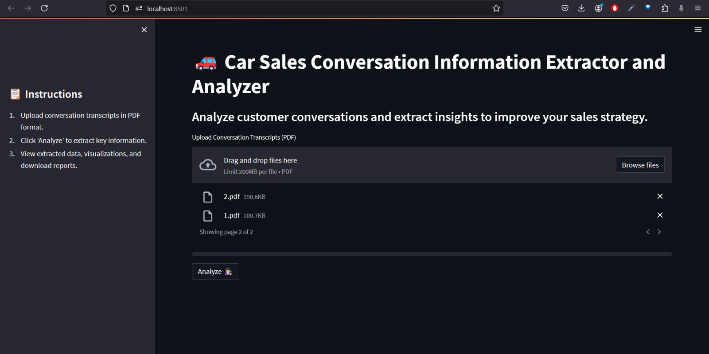
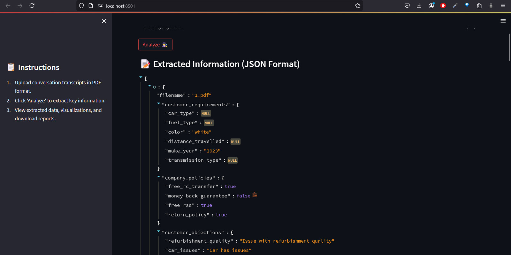
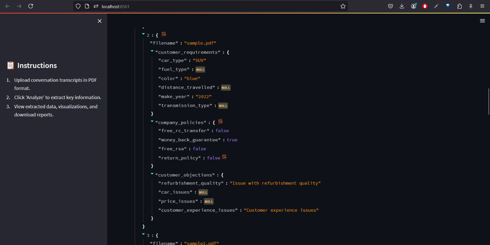
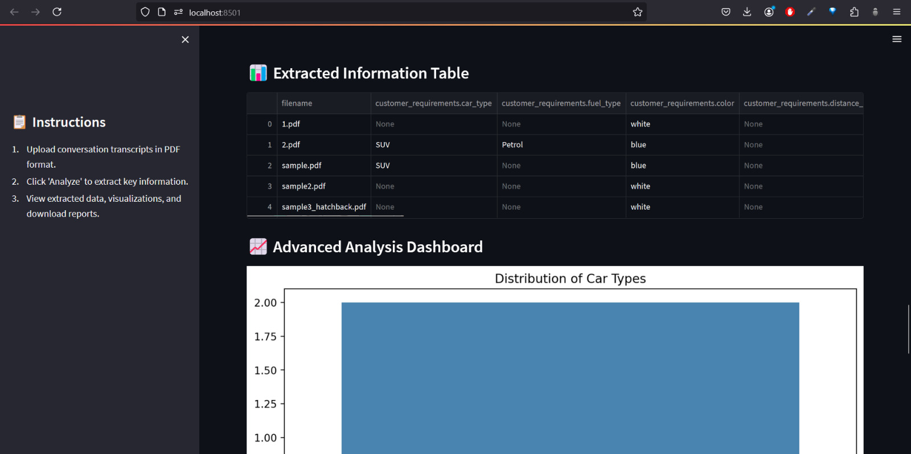
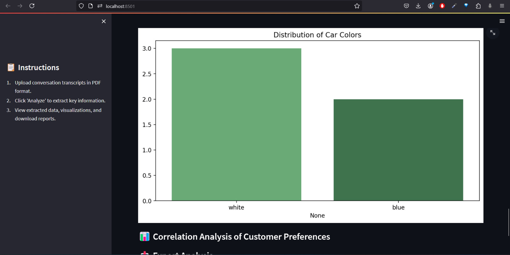
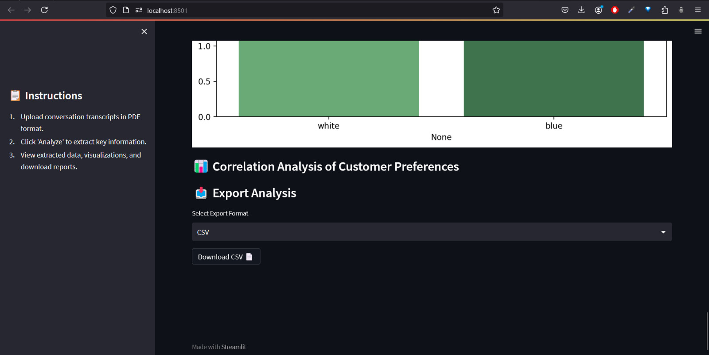
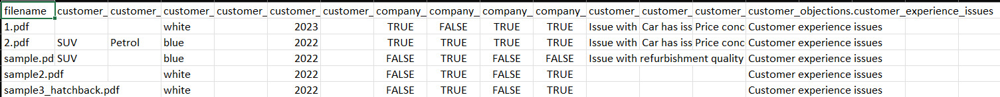

# **BERT + LLaMA-2 Conversation Analyzer**

## **Overview**

This project fine-tunes a LLaMA-2 model to analyze car sales conversations. The model is trained to understand and extract relevant information from conversations between customers and salespeople, such as customer preferences, objections, and discussed policies.

## **Features**

- **Fine-Tuned BERT + LLaMA-2 Model**: Custom models trained using JSON-based conversation transcripts.
- **Web Interface**: A Streamlit-based web interface allows users to upload conversation files and get instant analysis.
- **API Endpoint**: A REST API endpoint for programmatic access to the conversation analysis.
- **Scalable**: Easily deployable on cloud platforms like Heroku, AWS, etc.

## **Architecture Diagram**

  
_Architecture diagram._

## **Output**

  
  
  
  
  
  
  
  

## **Getting Started**

### **Prerequisites**

- Python 3.8+
- Pip (Python package manager)
- Virtualenv (optional but recommended)

### **Installation**

1. **Clone the Repository:**

   ```bash
   git clone https://github.com/VisaganSP/car-sales-extractor.git
   cd bert_llama2_conversation_analyzer
   ```

2. **Create and Activate a Virtual Environment:**

   ```bash
   python3 -m venv llama-env
   source llama-env/bin/activate
   ```

3. **Install Required Python Libraries:**

   ```bash
   pip install -r requirements.txt
   ```

4. **Download Pre-trained LLaMA-2 Weights:**
   Ensure that the LLaMA-2 model weights are available in the `models/llama2_finetuned/` directory.

### **Training the Model**

If you have your dataset of conversations in JSON format, you can fine-tune the LLaMA-2 model:

1. **Place Your Dataset in the `data/` Directory:**
   Ensure your JSON files are structured properly.

2. **Run the Training Script:**

   ```bash
   python scripts/train.py
   ```

3. **Check Model Outputs:**
   The fine-tuned model and tokenizer will be saved in the `models/llama2_finetuned/` directory.

### **Running the Application**

You can use the trained model in a Streamlit web application to analyze new conversations.

1. **Start the Streamlit Application:**

   ```bash
   streamlit run streamlit_app.py
   ```

2. **Access the Web Interface:**
   Open your web browser and navigate to `http://127.0.0.1:8501` to upload conversation files and see the analysis results.

### **API Usage**

The project also provides an API endpoint for analyzing conversations programmatically.

1. **Send a POST Request to the `/analyze` Endpoint:**

   ```bash
   curl -X POST -H "Content-Type: application/json" -d @conversation.json http://127.0.0.1:5000/analyze
   ```

2. **Response Format:**
   The API will return a JSON response with the analysis of the conversation.

### **Deployment**

#### **Deploying on Heroku**

1. **Create a Procfile:**

   ```plaintext
   web: python scripts/routes.py
   ```

2. **Deploy to Heroku:**

   ```bash
   heroku create
   git push heroku master
   ```

3. **Access the App:**
   After deployment, access your app via the Heroku-provided URL.

#### **Deploying on AWS (Elastic Beanstalk)**

1. **Initialize an Elastic Beanstalk Application:**

   ```bash
   eb init -p python-3.8 llama2-conversation-analyzer
   ```

2. **Create an Environment and Deploy:**

   ```bash
   eb create llama2-env
   eb deploy
   ```

3. **Access the App:**
   Access your application through the Elastic Beanstalk URL.

### **Testing**

1. **Unit Tests:**

   - Implement unit tests for key functionalities (e.g., loading the model, analyzing a conversation).
   - Use a testing framework like `pytest`.

2. **Run Tests:**
   ```bash
   pytest
   ```

### **Customization**

1. **Modifying the Model:**

   - You can adjust the `train.py` script to change hyperparameters, model architecture, or input data processing.

2. **Changing the Frontend:**
   - Modify the HTML templates in the `templates/` directory to customize the web interface.

### **Troubleshooting**

1. **Model Not Loading Properly:**

   - Ensure that the correct model weights are placed in the `models/llama2_finetuned/` directory.
   - Check file paths in the `model_loader.py` script.

2. **Error in Flask Application:**

   - Use Flask’s debug mode to get detailed error messages.
   - Ensure that all dependencies are installed as per `requirements.txt`.

3. **API Not Responding:**
   - Check the `/analyze` route and ensure that the JSON payload is correctly formatted.
   - Use tools like Postman to debug API requests.

### **Contributing**

1. **Fork the Repository:**

   - Fork this repository and make your contributions.

2. **Create a Pull Request:**
   - Submit a pull request with a detailed explanation of your changes.

### **License**

This project is licensed under the MIT License - see the [LICENSE](LICENSE) file for details.

### **Team**

1. Kaviraj K
2. Rithik Manogar S
3. Visagan S

### **Acknowledgments**

- **Meta AI** for the LLaMA model.
- **Hugging Face** for the Transformers library.
- **Streamlit** for the web framework.
- **Heroku** and **AWS** for deployment platforms.

---
